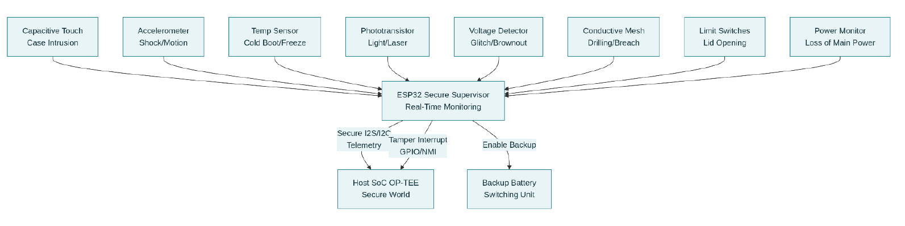
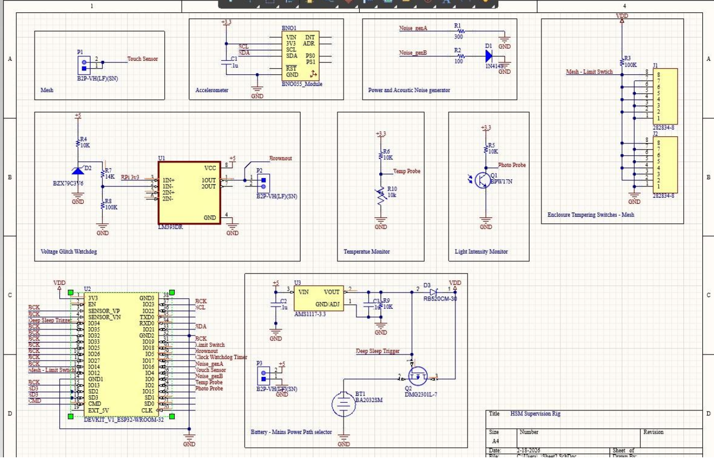
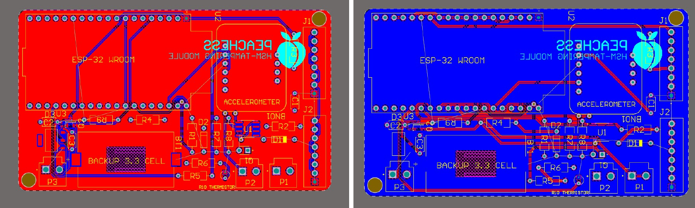
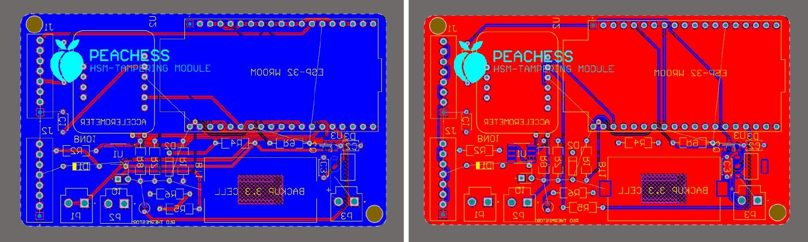
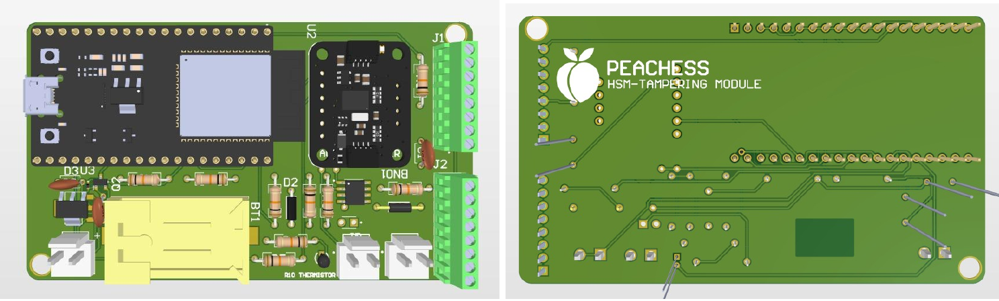
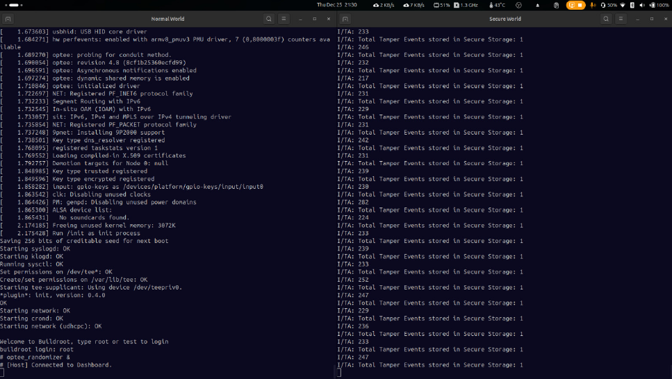
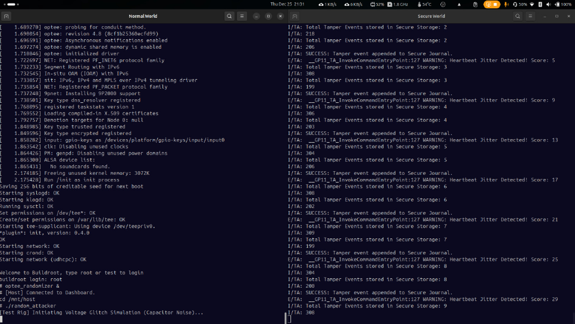
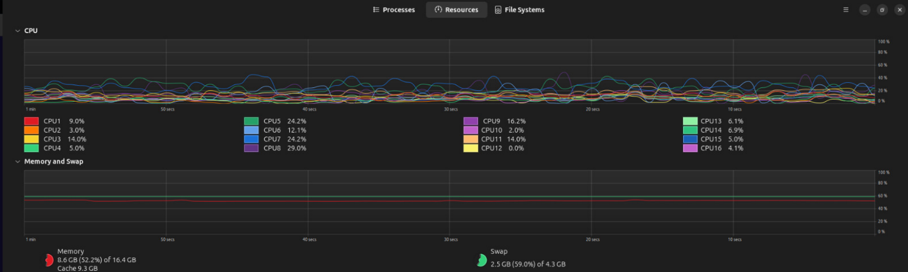
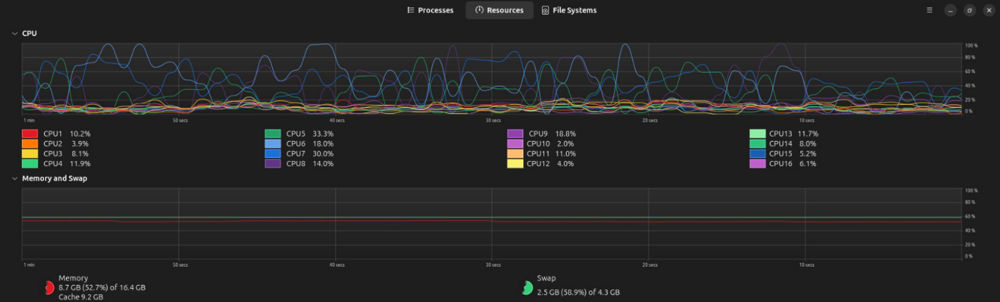
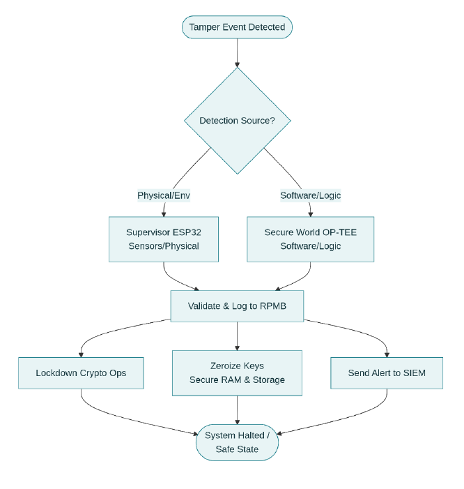

# OP-TEE Hardware Security Module (HSM)

<p align="left">
  <b>Tamper Detection • Secure Storage • Key Zeroization • OP-TEE Trusted Application</b>
</p>

<p align="center">


</p>

---

## Overview

This project implements a prototype **Hardware Security Module (HSM)** on **OP-TEE**. Security-critical operations execute inside the Trusted Execution Environment (TEE), while a Linux host application monitors external events and forwards trusted notifications to the Trusted Application.

### Key capabilities

- Secure key zeroization
- Persistent tamper journal
- Suspicion score engine
- Heartbeat & silence monitoring
- Temperature & voltage anomaly detection
- ESP32 I2C tamper monitoring
- Remote zeroization via TCP
- SIEM telemetry dashboard
- Persistent lockout after compromise

---

# System Architecture
<p align="center">
<br>
<em>Figure 1: Overall System Architecture</em>
</p>

---

# Hardware Platform

The tamper detection subsystem is implemented on a custom PCB designed to interface with the HSM host.

The board integrates:

- ESP32 microcontroller
- Temperature sensor
- Voltage monitoring circuitry
- I2C communication interface
- Tamper detection logic
- Expansion headers for additional sensors

The ESP32 continuously monitors attached sensors and reports authenticated tamper events to the Linux host over the I2C bus.

<p align="center">
<br>
<em>Figure 2.1: PCB Schematic</em>
</p>

<p align="center">
<br>
<em>Figure 2.2: Front side of PCB</em>
</p>

<p align="center">
<br>
<em>Figure 2.3: Back side of PCB</em>
</p>

<p align="center">
<br>
<em>Figure 2.4: Final 3D Render</em>
</p>

---
# Threat Model

| Threat | Detection | Response |
|---|---|---|
| Enclosure breach | ESP32 through I2C | Immediate zeroization |
| Voltage glitch | Host sensor | Increase suspicion |
| Temperature anomaly | External sensor | Increase suspicion |
| Heartbeat timeout | TA | Log + escalation |
| Remote compromise | TCP command | Remote zeroization |

---

# Feature Summary

## Trusted Application

- Secure Storage
- Tamper journal
- Suspicion score
- Persistent lockout
- Startup integrity verification
- Key zeroization

## Linux Host

- Heartbeat generation
- I2C monitoring
- Dashboard telemetry
- Remote command listener
- Sensor interface using ESP32

---

# Suspicion Score

| Event | Score |
|---|---:|
| Heartbeat jitter | +5 |
| Silence | +10 |
| Temperature anomaly | +25 |
| Voltage anomaly | +30 |
| I2C warning | +30 |
| Physical breach | Immediate Zeroization |

---

# Demonstration

## CPU Randomizer Attack

<table align="center">
<tr>
<td align="center"><br><b>Before Attack</b></td>
<td align="center"><br><b>After Attack</b></td>
</tr>
</table>


<table align="center">
<tr>
<td align="center"><br><b>Normal CPU Usage</b></td>
<td align="center"><br><b>During Attack</b></td>
</tr>
</table>

---

# System Flow

<p align="center">
<br>
<em>Figure 3: Tamper Detection Flow</em>
</p>

```text
             SIEM Dashboard
                    ^
                    │ JSON
                    │
        ┌────  Linux Host  ─────┐   
        |    (Normal World)     |   
        |                       |
        |                       |
        │                       │
    OP-TEE TA               Custom PCB
  (Secure World)             (ESP32)
        │                       │
  Secure Storage           Temp / Voltage /
 Suspicion Engine          Tamper Sensors
                               
        
```

---

# Project Structure

```text
host/        Linux host application
ta/          Trusted Application
Docs/        Images & documentation
README.md
```

---

# Technologies

- OP-TEE
- Trusted Execution Environment
- Secure Storage
- Linux I2C
- POSIX Threads
- TCP/IP
- JSON
- ESP32
- Raspberry Pi 3
- C

---

# Documentation
For a deep dive into the firmware logic, full hardware schematics, and extended setup guides, please refer to the [Full Project Documentation](./Docs/Documentation.pdf).